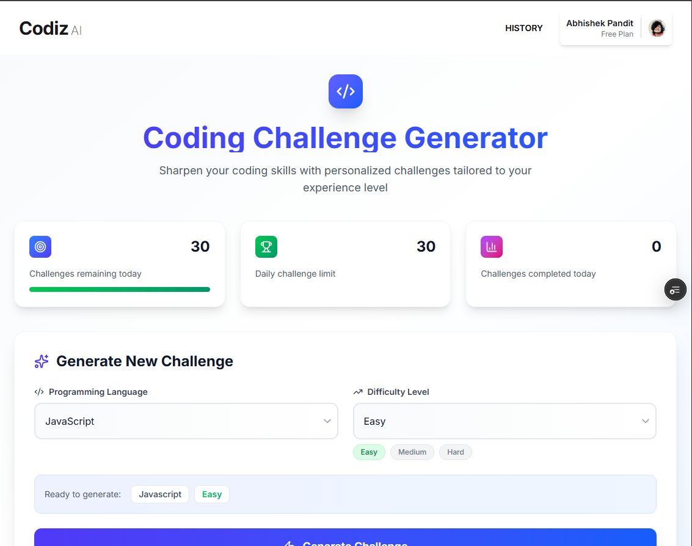
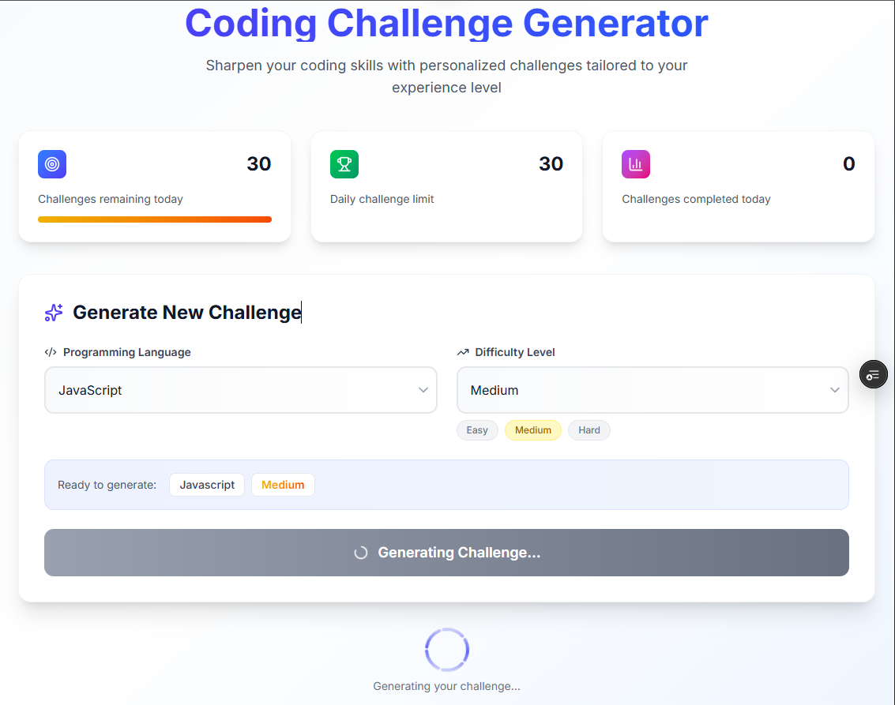
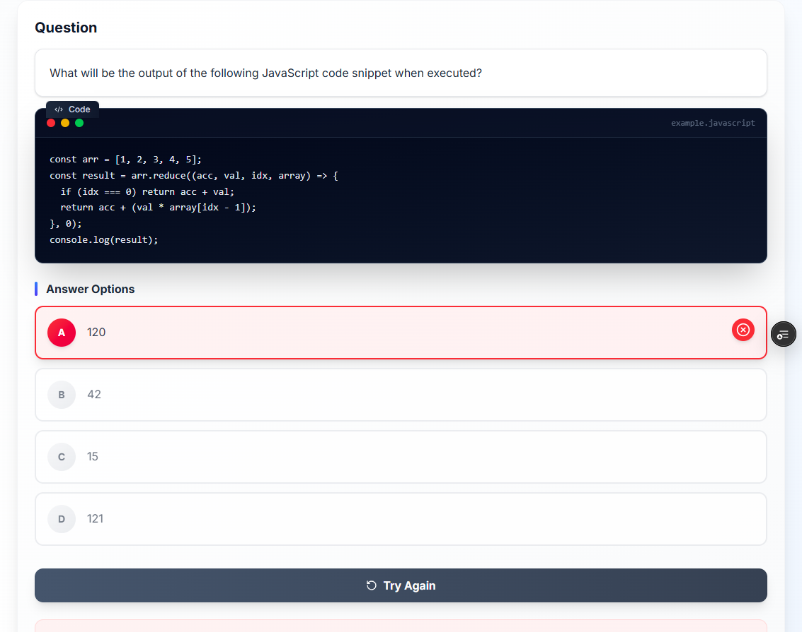
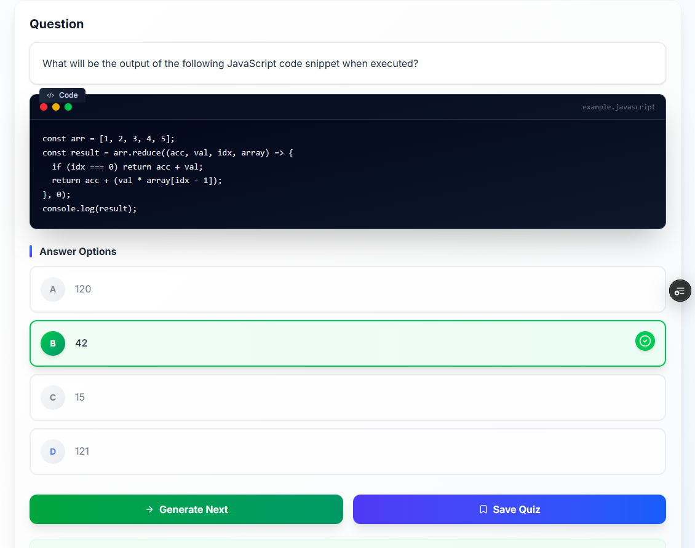

# Codiz 🤖💡

**Codiz** is an **AI-powered code assistance platform** designed to streamline development workflows and enhance code efficiency. Built as a modern full-stack web application, Codiz helps developers generate, refine, and understand code quickly and easily.

## 🚀 Live Demo

Experience the application in real-time:

[**ai-codiz.vercel.app**](https://ai-codiz.vercel.app/)

## ✨ Key Features

* **Intelligent Code Generation:** Instantly generate code snippets and solutions using cutting-edge AI.
* **[Insert Feature 2]:** E.g., Interactive code chat, syntax highlighting, or dark mode support.
* **[Insert Feature 3]:** E.g., User authentication, persistent chat history, or specific language support.
* **Full-Stack Architecture:** Reliable and scalable performance thanks to Next.js and Prisma.

## 💻 Tech Stack

Codiz is built using a modern and powerful technology stack:

| Category | Technology |
| :--- | :--- |
| **Framework** | Next.js (App Router) |
| **Language** | TypeScript |
| **Styling** | Tailwind CSS |
| **Database/ORM**| Prisma |
| **Deployment**| Vercel |

## 📸 SCREENSHOT 1: Main Landing Page Interface
<kbd>
    
</kbd>

<kbd>
    
</kbd>
## 📸 SCREENSHOT 1: Main Landing Quiz Interface

<kbd>
    
</kbd>

<kbd>
    
</kbd>
